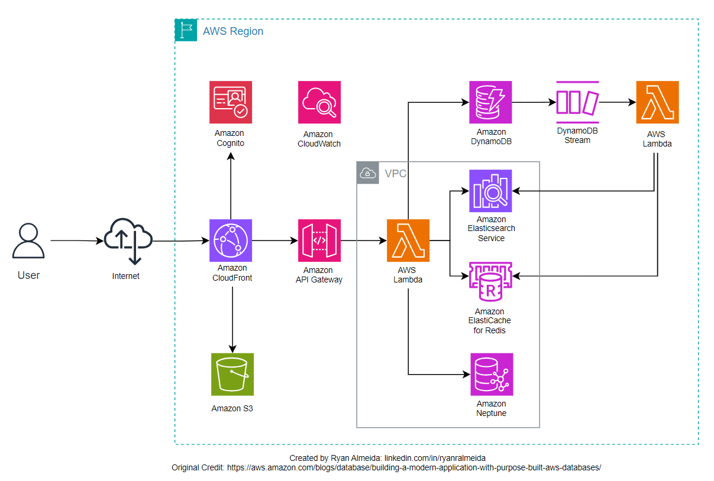

# Build a Bookstore Application with AWS Databases

## Project Description:
This project is an example built alongside an AWS Tutorial (https://aws.amazon.com/blogs/database/building-a-modern-application-with-purpose-built-aws-databases/) that allows you to build web storefornt, (a bookstore in this example) which is created on top of multiple databases, each addressing a different use case. Creating this demo bookstore web application allows you to learn various purpose-built AWS Databases such as DynamoDB, ElasticSeach Service, Elasticache for Redis and Neptune.

This is a great project to familiarize yourself with various database technologies offered within the AWS ecosystem, as well as using serverless and web deployment services in AWS, such as Lambda, API Gateway, and Cognito. You get to:

- Leverage DynamoDB as the durable system of record for the product catalog and learn the principles of NoSQL database design, scalability, and high availability.
- Integrate Amazon Elasticsearch to enhance search functionality, teaching you how to index and query data efficiently
- Use DynamoDB Streams with AWS Lambda for asynchronous updates to the Elasticsearch index and learn event-driven architecture and serverless computing concepts
- Implement Elasticache for Redis to manage a best sellers list to learn in-memory data storage techniques and performance optimization.
- Employing Amazon Neptune for social recommendations to gain insights into graph databases and personalized content delivery.
- Utilizing API Gateway and Lambda to handle various API calls highlights RESTful API design and serverless application development

## Architecture Diagram:

## Architecture Description:

| Component     | Functionality |
| ------------- | ------------- |
| DynamoDB      | Stores the product catalog; provides a durable, scalable NoSQL database for managing item data  |
| Content Cell  | Content Cell  |
| Content Cell  | Content Cell  |
| Content Cell  | Content Cell  |
| Content Cell  | Content Cell  |
| Content Cell  | Content Cell  |
| Content Cell  | Content Cell  |

## Functional Requirements:
- Search Functionality - Ensure books can be searched inside a search box and results can be returned to users quickly and accurately
- Product Catalog Management - Allow users to perform CRUD operations (Create, Read, Update, Delete) on the catalog
- Bestsellers List - Allow quick retrieval of best-selling items
- Personalized recommendations - Offer social recommendations based on user interactions and preferences

## Non-Functional Requirements:
- Scalability - Ensure the application can handle increasing loads by leveraging the scalability features of AWS services
- Availability 
- Performance
- Security
- Cost Efficiency 

